# 🎯 Ultimate Prompt Templates for GCP Documentation

> Use these prompts to generate world-class documentation that stands out from everything on the internet.

---

## 📋 Table of Contents

- [Prompt 1: Complete GCP Topic Documentation](#-prompt-1-complete-gcp-topic-documentation)
- [Prompt 2: Visual Learning Guide with Diagrams](#-prompt-2-visual-learning-guide-with-diagrams)
- [Prompt 3: Hands-On Lab Style Documentation](#-prompt-3-hands-on-lab-style-documentation)
- [Prompt 4: Quick Reference Cheat Sheet](#-prompt-4-quick-reference-cheat-sheet)
- [Prompt 5: Architecture & Flow Diagrams Only](#-prompt-5-architecture--flow-diagrams-only)
- [Pro Tips for Better Results](#-pro-tips-for-better-results)

---

## 🚀 PROMPT 1: Complete GCP Topic Documentation

```
You are a world-class technical documentation expert and GCP certified architect. Create the most comprehensive, visually stunning, and unique GitHub README.md documentation for [TOPIC NAME] that surpasses anything available on the internet.

## TOPIC: [INSERT YOUR TOPIC - e.g., "GCP Compute Engine", "GCP IAM", "GCP Networking"]

## REQUIREMENTS:

### 1. STRUCTURE & NAVIGATION
- Create a professional header with badges (GCP, status, version)
- Include a clickable Table of Contents with anchor links
- Add "Back to Top" and navigation buttons throughout
- Use collapsible sections (<details>) for lengthy content
- Include Previous/Next topic navigation

### 2. VISUAL ELEMENTS (MANDATORY)
- Create ASCII architecture diagrams showing component relationships
- Include Mermaid.js flowcharts for processes and workflows
- Add Mermaid.js sequence diagrams for API/service interactions
- Create comparison tables with emojis for visual distinction
- Use colored badges/shields for status indicators
- Include directory tree structures where applicable

### 3. CONTENT DEPTH
- Start with a "Why this matters" real-world scenario
- Explain concepts using analogies a beginner can understand
- Progress from beginner → intermediate → advanced
- Include "Under the Hood" sections explaining how things work internally
- Add "Common Mistakes" and "Pro Tips" callout boxes
- Compare UI vs CLI vs Terraform approaches for each operation

### 4. PRACTICAL EXAMPLES
- Provide complete, copy-paste ready code blocks
- Include real-world project examples (not just "demo-vm")
- Show before/after scenarios
- Add troubleshooting decision trees
- Include cost optimization tips

### 5. UNIQUE ELEMENTS (Make it stand out)
- Add a "Learning Path" visual roadmap
- Include "Interview Questions" section
- Create a "Quick Win" section for immediate hands-on practice
- Add "Real Production Scenarios" from actual companies
- Include "Security Checklist" with checkboxes
- Add "Cost Calculator" examples

### 6. FORMATTING RULES
- Use proper heading hierarchy (H1 → H2 → H3)
- Add blank lines before lists and after headers
- Use syntax highlighting for all code blocks (bash, yaml, json, hcl)
- Include line-by-line explanations for complex commands
- Use blockquotes for tips, warnings, and notes
- Add horizontal rules to separate major sections

### 7. DIAGRAMS TO INCLUDE (use Mermaid.js syntax)
- Architecture overview diagram
- Request/Response flow diagram
- Decision tree for choosing options
- Component relationship diagram
- Deployment pipeline visualization

## OUTPUT FORMAT:
- Pure GitHub-flavored Markdown
- Mobile-responsive design
- Print-friendly structure
- Copy-paste ready

## QUALITY STANDARDS:
- Zero placeholder text - everything must be real and accurate
- Every command must be tested and working
- Include GCP documentation links for further reading
- Add last-updated date

Create this documentation now. Make it the definitive resource that people bookmark and share.
```

---

## 🎨 PROMPT 2: Visual Learning Guide with Diagrams

```
You are a visual learning expert and GCP solutions architect. Create a highly visual, diagram-rich GitHub README.md for [TOPIC NAME] that teaches through pictures, flowcharts, and visual metaphors.

## TOPIC: [INSERT YOUR TOPIC]

## VISUAL REQUIREMENTS:

### MANDATORY DIAGRAMS (Use Mermaid.js):

1. **Architecture Diagram** - Show all components and their relationships
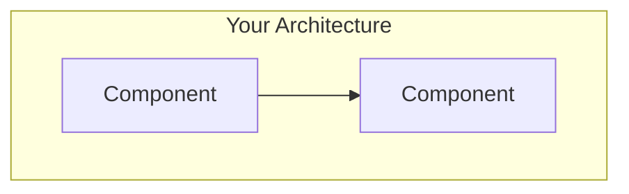

2. **Flow Diagram** - Show the process step-by-step
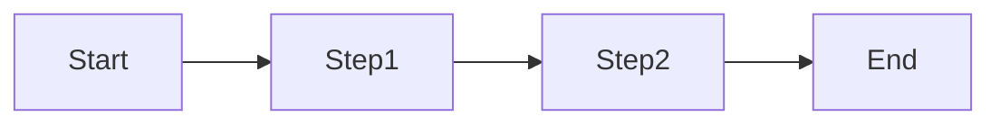

3. **Sequence Diagram** - Show interactions between services
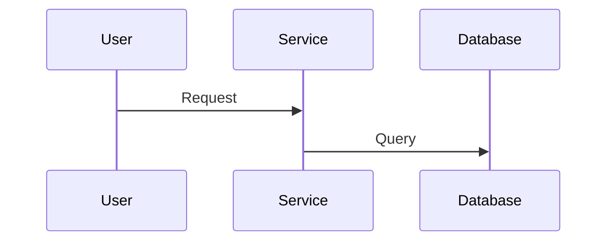

4. **Decision Tree** - Help users choose the right option
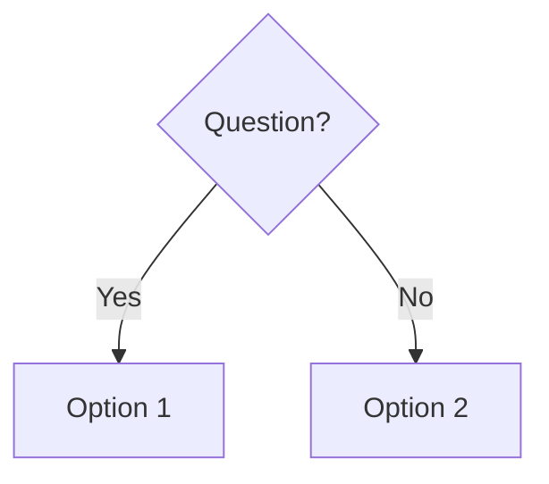

5. **State Diagram** - Show lifecycle states
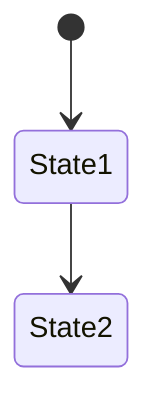

6. **Mind Map** - Show concept relationships
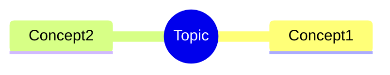

### ADDITIONAL VISUAL ELEMENTS:
- ASCII art for simple illustrations
- Emoji-based visual legends
- Color-coded tables
- Icon-based feature comparisons
- Visual checklists with progress indicators
- Before/After comparison layouts
- Visual cost breakdowns
- Timeline diagrams for processes

### STRUCTURE:
1. Hero section with topic overview diagram
2. "How it Works" with animated-style flow
3. "Components Explained" with relationship diagram
4. "Step-by-Step Guide" with numbered visual flow
5. "Decision Guide" with flowchart
6. "Troubleshooting" with decision tree
7. "Quick Reference" with visual cheat sheet

Make every concept visually understandable. A reader should grasp 80% just from the diagrams.
```

---

## 🧪 PROMPT 3: Hands-On Lab Style Documentation

```
You are a GCP training instructor creating a hands-on lab guide. Create a GitHub README.md for [TOPIC NAME] structured as an interactive, progressive lab experience.

## TOPIC: [INSERT YOUR TOPIC]

## LAB STRUCTURE:

### FORMAT EACH SECTION AS:
```
## 🧪 Lab [X]: [Title]

⏱️ **Duration:** XX minutes
🎯 **Objective:** What they'll achieve
📋 **Prerequisites:** What they need first

### What You'll Build
[Diagram of end result]

### Step 1: [Action]
**Why:** Explanation
**Command:**
```bash
command here
```
**Expected Output:**
```
output here
```
**✅ Checkpoint:** How to verify success

### Step 2: [Action]
...

### 🎉 Lab Complete!
**What you learned:**
- Point 1
- Point 2

**🚀 Challenge (Optional):** Extended exercise

**🔗 Next Lab:** [Link to next]
```

### INCLUDE THESE LABS:
1. **Lab 0:** Environment Setup (5 min)
2. **Lab 1:** Basic Operations (15 min)
3. **Lab 2:** Intermediate Features (20 min)
4. **Lab 3:** Advanced Configurations (25 min)
5. **Lab 4:** Real-World Project (30 min)
6. **Lab 5:** Troubleshooting Scenarios (20 min)
7. **Bonus Lab:** Production Best Practices (30 min)

### REQUIRED ELEMENTS:
- Progress tracker at the top
- Estimated total time
- Difficulty rating (⭐⭐⭐⭐⭐)
- "Stuck?" expandable hints
- Cleanup/teardown instructions
- Cost warnings where applicable
- Screenshot placeholders with descriptions

Make it feel like a professional certification lab experience.
```

---

## 📑 PROMPT 4: Quick Reference Cheat Sheet

```
You are a developer productivity expert. Create the ultimate GCP [TOPIC NAME] cheat sheet as a GitHub README.md that developers will bookmark and use daily.

## TOPIC: [INSERT YOUR TOPIC]

## CHEAT SHEET REQUIREMENTS:

### STRUCTURE:
```
# 🚀 [TOPIC] Cheat Sheet

> One-page reference for everything you need

## 🔥 Most Used Commands
| Action | Command |
|--------|---------|
| Do X   | `command` |

## ⚡ Quick Start (30 seconds)
```bash
# Copy-paste this to get started
command1
command2
command3
```

## 📊 Comparison Tables
| Feature | Option A | Option B | Option C |
|---------|----------|----------|----------|
| Price   | 💰       | 💰💰     | 💰💰💰   |
| Speed   | 🚀       | 🚀🚀     | 🚀🚀🚀   |

## 🎯 Decision Quick Guide
- Need X? → Use `command`
- Need Y? → Use `command`
- Need Z? → Use `command`

## ⚠️ Common Gotchas
| Problem | Solution |
|---------|----------|
| Error X | Fix Y    |

## 🔗 Quick Links
- [Official Docs](url)
- [Pricing](url)
- [API Reference](url)
```

### MUST INCLUDE:
- Maximum 1 scroll page for core content
- Expandable sections for details
- Copy buttons context (triple backticks)
- Visual indicators (emojis) for quick scanning
- "TL;DR" at the very top
- Keyboard shortcuts if applicable
- Version/date stamp

Make it scannable in 10 seconds, usable in 30 seconds.
```

---

## 📐 PROMPT 5: Architecture & Flow Diagrams Only

```
You are a solutions architect. Create a GitHub README.md containing ONLY diagrams and visual explanations for [TOPIC NAME]. No lengthy text - let the visuals speak.

## TOPIC: [INSERT YOUR TOPIC]

## REQUIRED DIAGRAMS:

### 1. High-Level Architecture
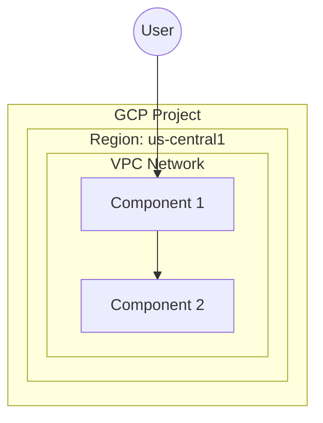

### 2. Data Flow
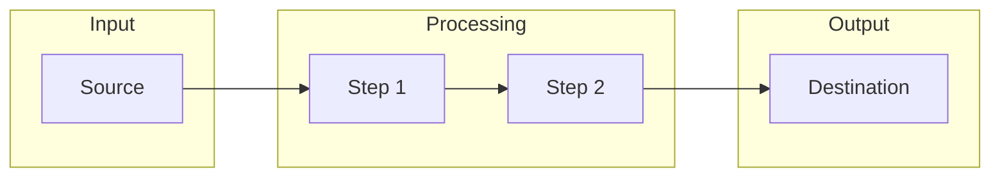

### 3. Service Interaction
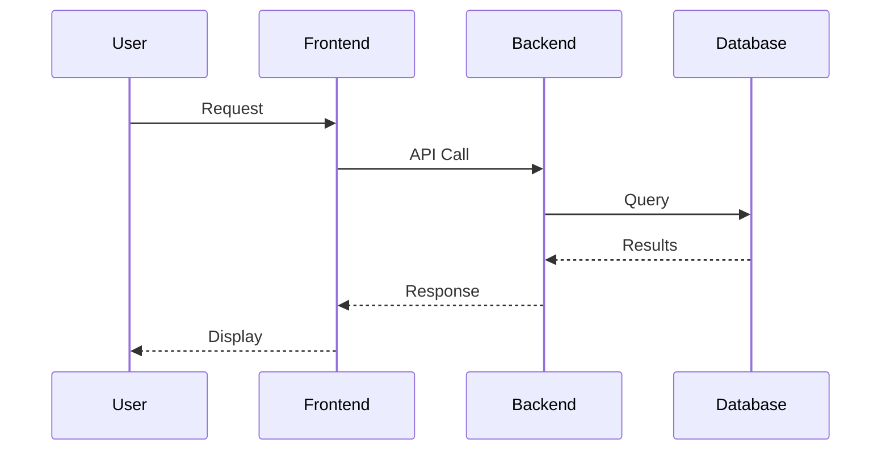

### 4. Component Lifecycle
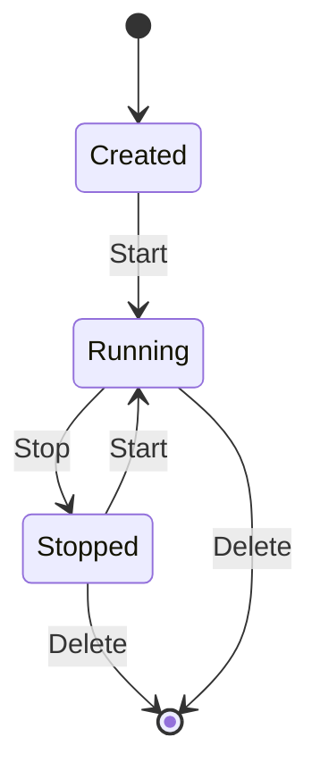

### 5. Decision Flowchart
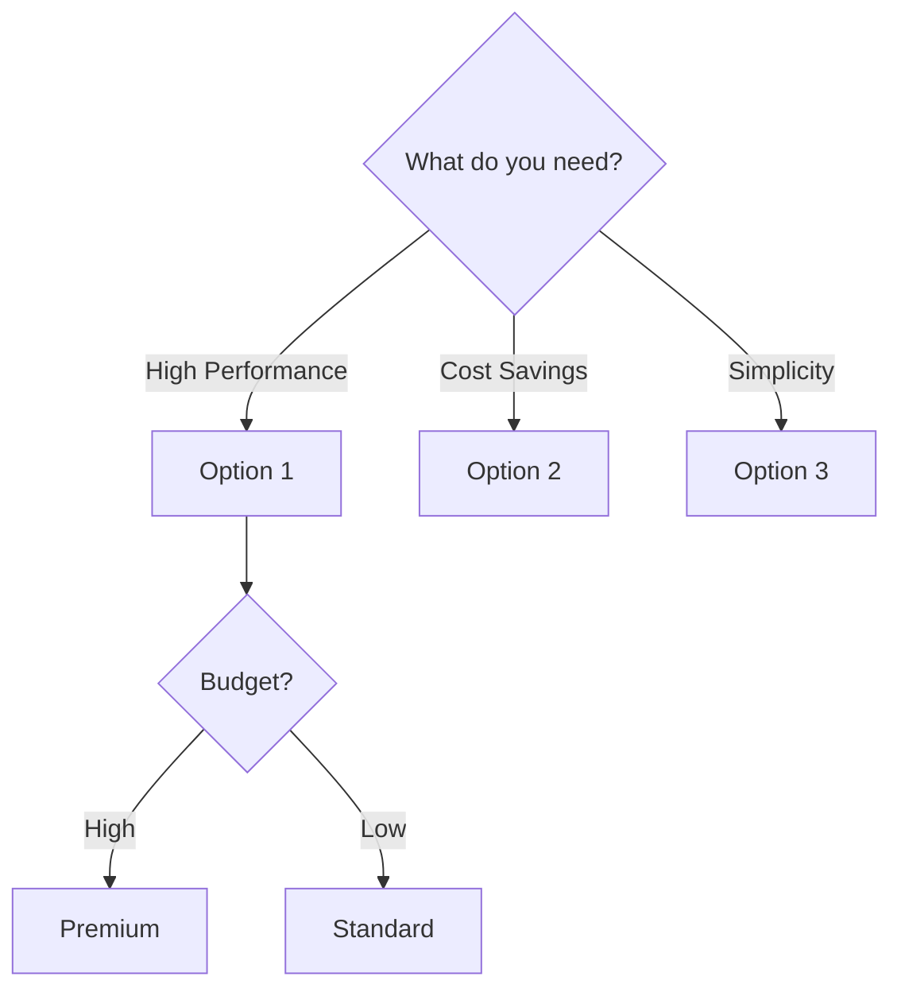

### 6. Network Topology
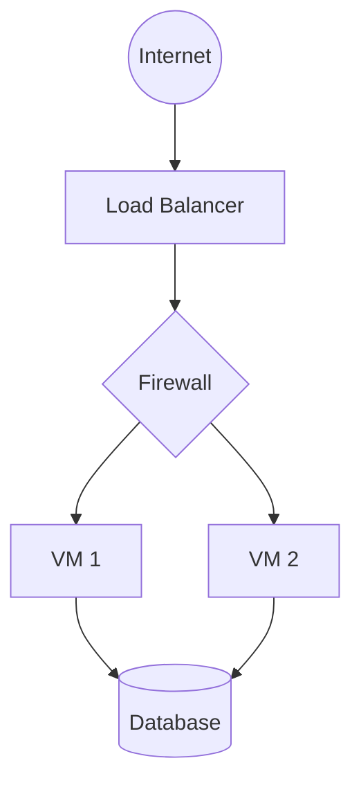

### 7. CI/CD Pipeline
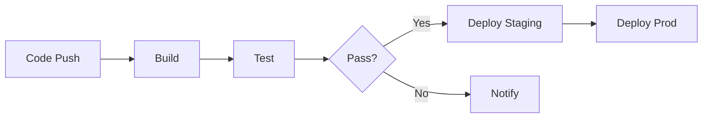

### 8. Cost Breakdown (Visual)
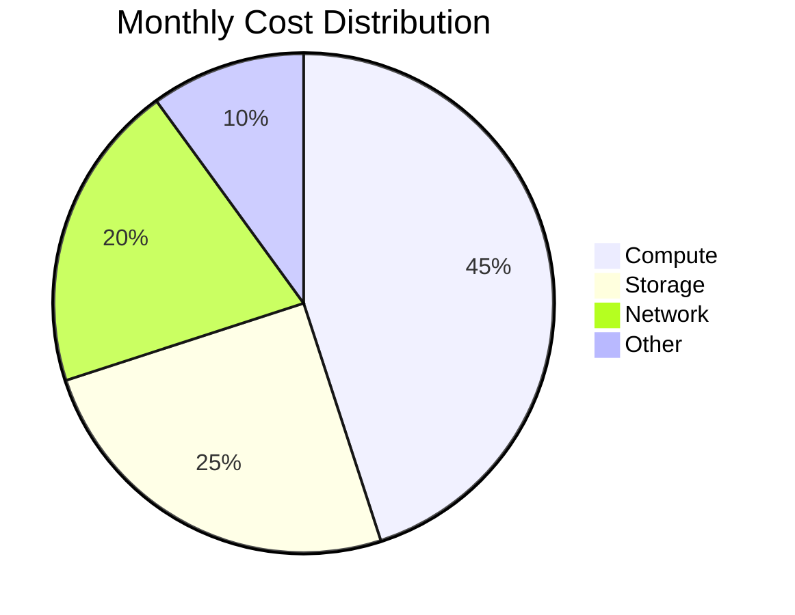

Include brief 1-line captions under each diagram. That's it.
```

---

## 💡 PRO TIPS FOR BETTER RESULTS

### 🎯 Tip 1: Be Specific About Your Topic
```
❌ Bad:  "Create documentation for GCP"
✅ Good: "Create documentation for GCP Compute Engine focusing on auto-scaling and instance groups for e-commerce workloads"
```

### 🎯 Tip 2: Specify Your Audience
```
Add to your prompt:
"Target Audience: 
- Junior developers with 1 year experience
- Familiar with AWS but new to GCP
- Learning for GCP Associate certification"
```

### 🎯 Tip 3: Request Specific Scenarios
```
Add to your prompt:
"Include these real-world scenarios:
1. Startup with 1000 daily users
2. Enterprise with compliance requirements
3. Cost-conscious small business"
```

### 🎯 Tip 4: Ask for Comparisons
```
Add to your prompt:
"Compare with:
- AWS equivalent services
- Azure equivalent services
- When to use each option"
```

### 🎯 Tip 5: Request Updates Format
```
Add to your prompt:
"Include a changelog section and mark any features that are:
- 🆕 New (last 6 months)
- ⚠️ Deprecated
- 🔜 Coming soon (Beta/Preview)"
```

---

## 🔄 COMBINE PROMPTS FOR BEST RESULTS

```
First prompt:  Use PROMPT 1 to create comprehensive documentation
Second prompt: Use PROMPT 5 to add more diagrams
Third prompt:  Use PROMPT 4 to create a quick reference appendix
Fourth prompt: "Now review everything and add:
               - Cross-references between sections
               - Consistent emoji usage
               - Fix any broken links
               - Add 5 more real-world examples"
```

---

## 📝 QUICK START TEMPLATE

Copy this and fill in the blanks:

```
Create a comprehensive GitHub README.md documentation for GCP [TOPIC].

Audience: [beginner/intermediate/advanced]
Focus: [CLI/Console/Terraform/All]
Style: [Tutorial/Reference/Lab/Cheatsheet]

Must include:
1. Architecture diagram (Mermaid.js)
2. Step-by-step commands with explanations
3. Real-world example: [your scenario]
4. Troubleshooting section
5. Cost considerations
6. Security best practices

Make it visually stunning with proper formatting, emojis, tables, and collapsible sections.

The documentation should be so good that it becomes the go-to resource people bookmark and share.
```

---

<div align="center">

## ⭐ Save This File!

Use these prompts to create documentation that stands out.

**Created by devopsbyrushi**

</div>
